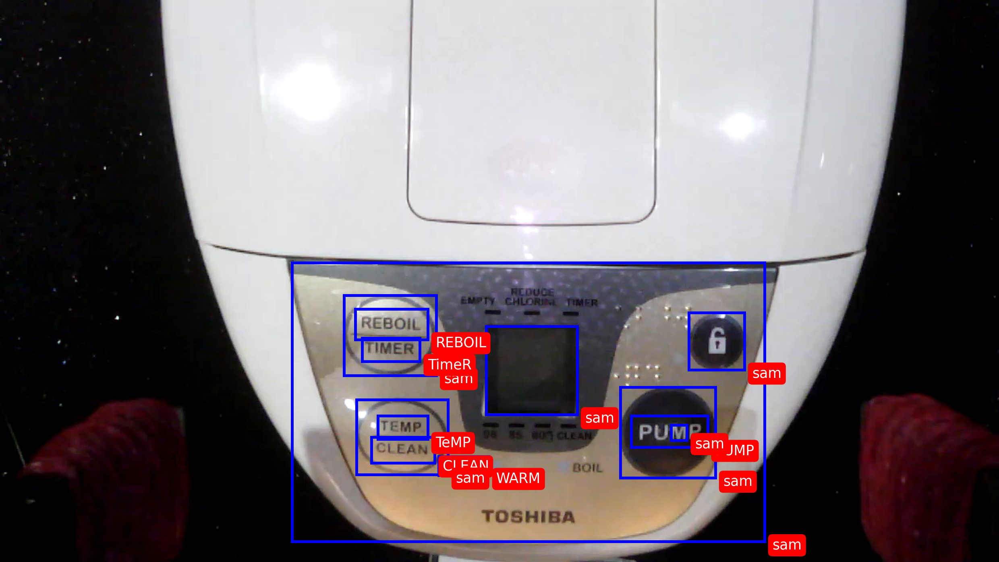
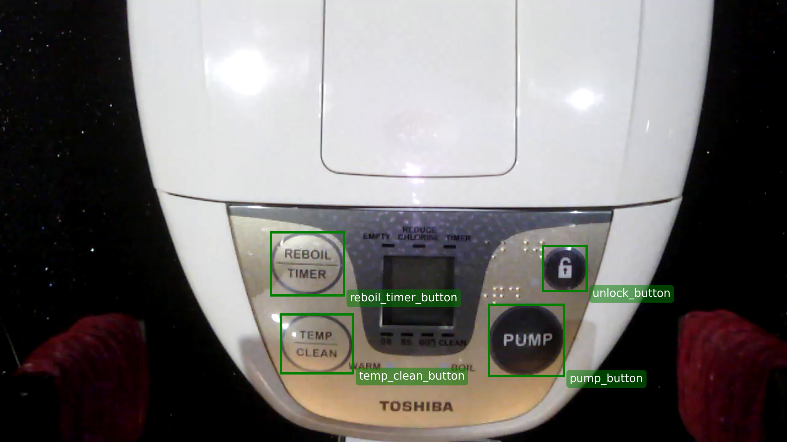
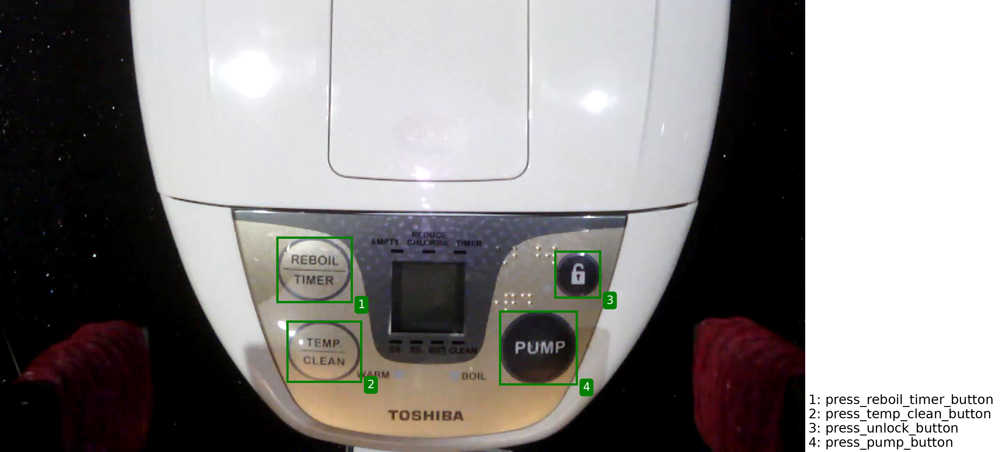

# Steps to Ground Actions on Appliances

## Sample Button Detection Result 


## Sample Button Grounding Result 


## Sample Action Grounding Result


---

## Required Inputs
Each appliance requires a **user manual** and an **observation image**. Place them in:

```
data/{water_dispenser}/_0_input
```

### File Naming:
- **User manual**: `_0_pdf.pdf` (can have any filename)
- **Observation image**: `0.png` (should be an index)

---

## Output Formats
Outputs are saved in:

```
data/{water_dispenser}/output_{0}   # (0 is the number from the observation file name)
```

### Key Output File:
- **Grounded Action Bounding Box**:  
  ```
  {output_folder}/_3_visual_grounding/_1_action_names/_2_proposed_action_bbox.json
  ```

---

## Prerequisite:
These steps must be completed before running `ground_action.py`.

### 1. Clone this repo
Run the following command to clone the repository:

```bash
git clone --recurse-submodules https://github.com/zhangj1an/button_scripts.git
```

Check that the **FastSAM** repo is downloaded as a submodule under `tools/foundation_models/FastSAM`.

### 2. Start OWLv2 API
Navigate to the `tools/foundation_models` directory and run:

```bash
srun -u -o "api-owlv2-log.out" -w crane5 --mem=20000 --gres=gpu:1 --cpus-per-task=4 --time=03:00:00 --job-name "owlv2" \
    uvicorn owlv2_crane5_api:app --host=0.0.0.0 --port=4229 --reload --loop asyncio
```

- The job is set to run for **3 hours**.
- Check `api-owlv2-log.out` for this message to confirm that OWLv2 is ready:
  ```
  Application startup complete.
  ```

---

### 3. Add API Key to GPT-4o Model
Edit `tools/foundation_models/gpt_4o_model.py` and update **line 19**:

```python
os.environ["OPENAI_API_KEY"] = "<your-api-key>"
```

> **Note:**  
> - `tools/foundation_models/claude_sonnet_model.py` is also referenced in `resolve_duplicate_bbox_id_for_one_instance()`,  
>   but it is currently unused. Unsure if an API key is needed there.

---

## Run Ground Actions
From the **root directory**, execute:

```bash
srun -u -o "log.out" -w crane2 --mem=20000 --gres=gpu:1 --cpus-per-task=8 --job-name "vlm" python3 ground_actions.py
```

